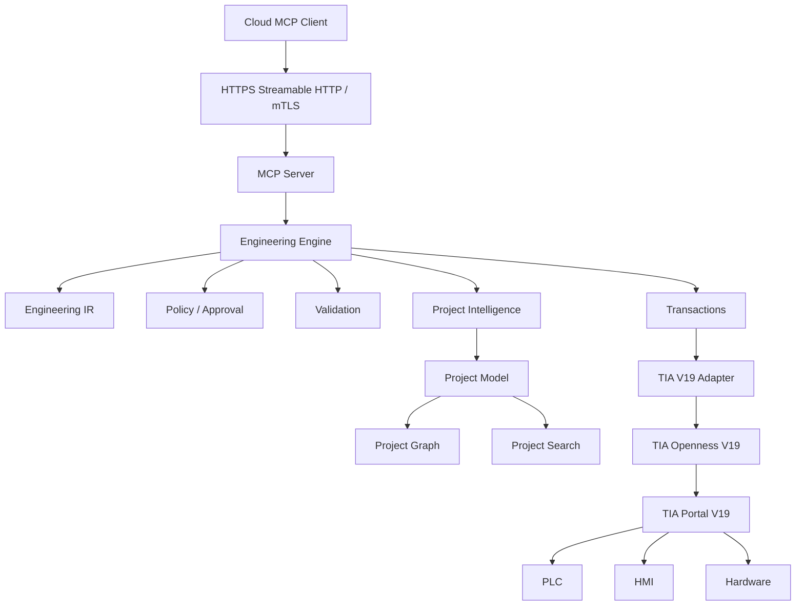

# System Architecture

## Target

Engineer-PC execution platform for AI-assisted Siemens TIA Portal V19 engineering.

```mermaid
flowchart TB
    CLOUD[Cloud MCP Client]
    HTTPS[HTTPS Streamable HTTP / mTLS]
    MCP[MCP Server]
    ENGINE[Engineering Engine]
    IR[Engineering IR]
    POLICY[Policy / Approval]
    VALIDATE[Validation]
    TX[Transactions]
    INTEL[Project Intelligence]
    MODEL[Project Model]
    GRAPH[Project Graph]
    SEARCH[Project Search]
    ADAPTER[TIA V19 Adapter]
    OPENNESS[TIA Openness V19]
    TIA[TIA Portal V19]
    PLC[PLC]
    HMI[HMI]
    HW[Hardware]

    CLOUD --> HTTPS --> MCP --> ENGINE
    ENGINE --> IR
    ENGINE --> POLICY
    ENGINE --> VALIDATE
    ENGINE --> TX
    ENGINE --> INTEL
    INTEL --> MODEL
    MODEL --> GRAPH
    MODEL --> SEARCH
    TX --> ADAPTER
    ADAPTER --> OPENNESS --> TIA
    TIA --> PLC
    TIA --> HMI
    TIA --> HW
```

## Core rule

Only `EngineerPc.Tia.V19` may reference Siemens.Engineering.
